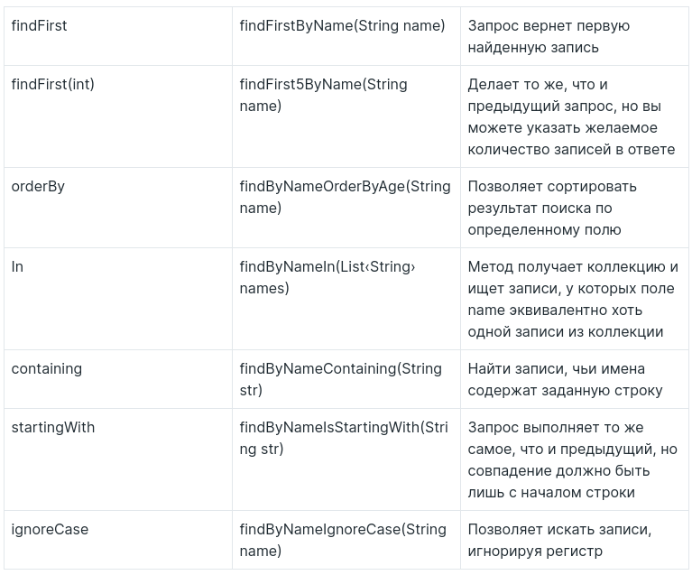

# Базы данных и SQL

## Spring Data

### Сущности

Аннотации:

- @Entity
- @Id и @GeneratedValue
- @ManyToOne @OneToMany @ManyToMany @JoinColumn
- FetchType

### Репозитории

Интерфейс **JpaRepository**

Методы:

- save()
- findById()
- findAll()
- deleteById()

## SQL

- SELECT
- INSERT
- UPDATE
- DELETE

## HW

https://skyengpublic.notion.site/3-3-c3c2a6eb72b34d1b8e55ec214a3e26c9
https://skyengpublic.notion.site/3-4-SQL-44e31f0c3b48423fb4d824fadec60d1a
